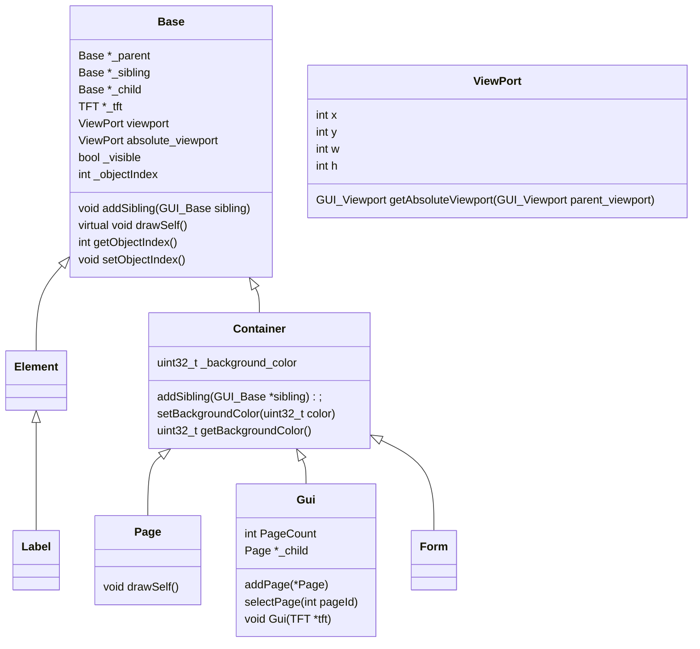

```mermaid
classDiagram


    
    Base <|-- Element
    Base <|-- Container
    Container <|-- Page
    Container <|-- Gui
    Container <|-- Form

    Element <|-- Label

    class ViewPort{
        int x
        int y
        int w
        int h
        GUI_Viewport getAbsoluteViewport(GUI_Viewport parent_viewport)
    }

    class Base{
        Base *_parent
        Base *_sibling
        Base *_child
        TFT *_tft        
        ViewPort viewport
        ViewPort absolute_viewport
        void addSibling(GUI_Base sibling)
        virtual void drawSelf()
        int getObjectIndex()
        void setObjectIndex()
        bool _visible
        int _objectIndex
    }


    class Element{

    }

    class Container{
        addSibling(GUI_Base *sibling);
        setBackgroundColor(uint32_t color)
        uint32_t getBackgroundColor()

        uint32_t _background_color
    }


    class Gui{
        int PageCount
        addPage(*Page)
        selectPage(int pageId)
        void Gui(TFT *tft)
        Page *_child

    }

    class Page{
        void drawSelf()
    }

    class Form{
    }


```

